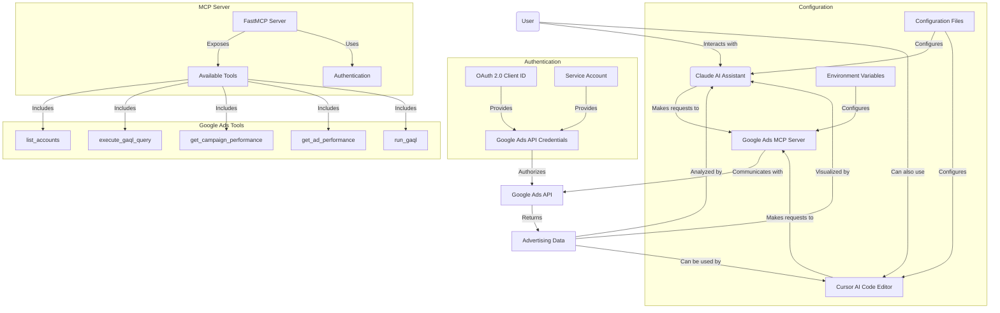
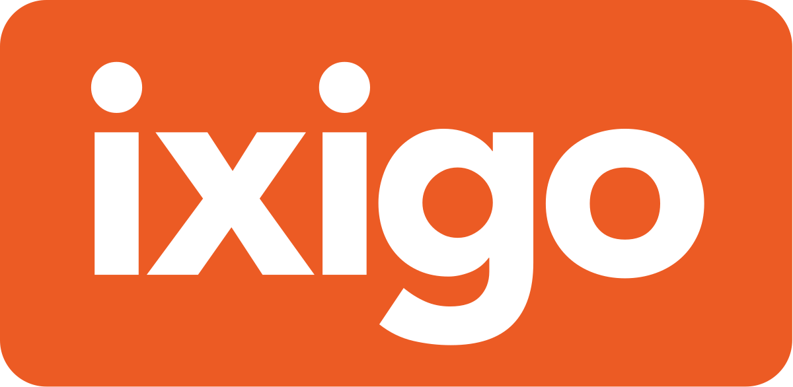

# Google Ads MCP


A tool that connects [Google Ads](https://ads.google.com/) with Claude AI, allowing you to analyze your advertising data through natural language conversations. This integration gives you access to campaign information, performance metrics, keyword analytics, and ad management—all through simple chat with Claude.

---

## What Can This Tool Do For Advertising Professionals?

1. **Account Management**  
   - See all your Google Ads accounts in one place
   - Get account details and basic campaign information

2. **Campaign Analytics & Reporting**  
   - Discover which campaigns are performing best
   - Track impressions, clicks, conversions, and cost metrics
   - Analyze performance trends over time
   - Compare different time periods to spot changes
   - **Visualize your data** with charts and graphs created by Claude

3. **Keyword & Ad Performance**  
   - Identify top and underperforming keywords
   - Analyze ad copy effectiveness 
   - Check quality scores and competitive metrics
   - Get actionable insights on how to improve your campaigns

4. **Budget & Bid Management**  
   - Monitor campaign budgets and spending
   - Analyze bid strategies and performance
   - Identify opportunities for optimization
   - Get recommendations for budget allocation

---

## Google Ads MCP Architecture Flow



## Available Tools

Here's what you can ask Claude to do once you've set up this integration:

| **What You Can Ask For**        | **What It Does**                                            | **What You'll Need to Provide**                                 |
|---------------------------------|-------------------------------------------------------------|----------------------------------------------------------------|
| `list_accounts`                 | Shows all your Google Ads accounts                          | Nothing - just ask!                                             |
| `execute_gaql_query`            | Runs a Google Ads Query Language query                      | Your account ID and a GAQL query                               |
| `get_campaign_performance`      | Shows campaign metrics with performance data                | Your account ID and time period                                 |
| `get_ad_performance`            | Detailed analysis of your ad creative performance           | Your account ID and time period                                 |
| `run_gaql`                      | Runs any arbitrary GAQL query with formatting options       | Your account ID, query, and format (table, JSON, or CSV)        |

### Using the Advanced Query Tools

The `run_gaql` tool is especially powerful as it allows you to run any custom Google Ads Query Language (GAQL) query. Here are some example queries you can use:

### Example 1: Basic campaign metrics

```sql
SELECT 
    campaign.name, 
    metrics.clicks, 
    metrics.impressions 
FROM campaign 
WHERE segments.date DURING LAST_7DAYS
```

### Example 2: Ad group performance

```sql
SELECT 
    ad_group.name, 
    metrics.conversions, 
    metrics.cost_micros 
FROM ad_group 
WHERE metrics.clicks > 100
```

### Example 3: Keyword analysis

```sql
SELECT 
    keyword.text, 
    metrics.average_position, 
    metrics.ctr 
FROM keyword_view 
ORDER BY metrics.impressions DESC
```

*For a complete list of all available tools and their detailed descriptions, ask Claude to "list tools" after setup.*

---

## Getting Started (No Coding Experience Required!)

### 1. Set Up Google Ads API Access

Before using this tool, you'll need to create API credentials that allow Claude to access your Google Ads data. You can choose between two authentication methods:

#### Option A: OAuth 2.0 Client ID (User Authentication)

Best for individual users or desktop applications:

1. Go to the [Google Cloud Console](https://console.cloud.google.com/)
2. Create a new project or select an existing one
3. Enable the Google Ads API
4. Go to "Credentials" → "Create Credentials" → "OAuth Client ID"
5. Choose "Desktop Application" as the application type
6. Download the OAuth client configuration file (client_secret.json)
7. Create a Google Ads API Developer token (see below)

#### Option B: Service Account (Server-to-Server Authentication)

Better for automated systems or managing multiple accounts:

1. Go to the [Google Cloud Console](https://console.cloud.google.com/)
2. Create a new project or select an existing one
3. Enable the Google Ads API
4. Go to "Credentials" → "Create Credentials" → "Service Account"
5. Download the service account key file (JSON)
6. Grant the service account access to your Google Ads accounts
7. Create a Google Ads API Developer token (see below)

#### Authentication Token Refreshing

The application now includes robust token refresh handling:

- **OAuth 2.0 Tokens**: The tool will automatically refresh expired OAuth tokens when possible, or prompt for re-authentication if the refresh token is invalid.
- **Service Account Tokens**: Service account tokens are automatically generated and refreshed as needed without user intervention.

#### Authentication Method Comparison

Choose OAuth 2.0 Client ID if:

- You're building a desktop application
- Users need to explicitly grant access
- You're managing a single account or a few personal accounts
- You want users to have control over access permissions

Choose Service Account if:

- You're building an automated system
- You need server-to-server authentication
- You're managing multiple accounts programmatically
- You don't want/need user interaction for authentication
- You need automatic token refreshing without user intervention

#### Getting a Developer Token

1. Sign in to your Google Ads account at [https://ads.google.com](https://ads.google.com)
2. Click on Tools & Settings (wrench icon) in the top navigation
3. Under "Setup", click "API Center"
4. If you haven't already, accept the Terms of Service
5. Click "Apply for token" 
6. Fill out the application form with details about how you plan to use the API
7. Submit the application and wait for approval (usually 1-3 business days)

Note: Initially, you'll get a test Developer Token that has some limitations. Once you've tested your implementation, you can apply for a production token that removes these restrictions.

### Understanding the Login Customer ID

The `GOOGLE_ADS_LOGIN_CUSTOMER_ID` is optional and is primarily used when:

- You're working with a Google Ads Manager Account (MCC)
- You need to access multiple client accounts under that manager account

The Login Customer ID should be your Manager Account ID (format: XXX-XXX-XXXX) if:

- You're accessing multiple accounts under a manager account
- You want to use manager account credentials to access client accounts

You can skip this setting if:

- You're only accessing a single Google Ads account
- You're using credentials directly from the account you want to access

To find your Manager Account ID:

1. Sign in to your Google Ads Manager Account
2. Click on the settings icon (gear)
3. Your Manager Account ID will be displayed in the format XXX-XXX-XXXX
4. Download the credentials file (a JSON file)

**🎬 Watch this beginner-friendly tutorial on Youtube:**
COMING SOON

### 2. Install Required Software

You'll need to install these tools on your computer:

- [Python](https://www.python.org/downloads/) (version 3.11 or newer) - This runs the connection between Google Ads and Claude
- [Node.js](https://nodejs.org/en) - Required for running the MCP inspector and certain MCP components
- [Claude Desktop](https://claude.ai/download) - The AI assistant you'll chat with

Make sure both Python and Node.js are properly installed and available in your system path before proceeding.

### 3. Download the Google Ads MCP 

You need to download this tool to your computer. The easiest way is:

1. Click the green "Code" button at the top of this page
2. Select "Download ZIP"
3. Unzip the downloaded file to a location you can easily find (like your Documents folder)

Alternatively, if you're familiar with Git:

```bash
git clone https://github.com/ixigo/mcp-google-ads.git
```

### 4. Install Required Components

Open your computer's Terminal (Mac) or Command Prompt (Windows):

1. Navigate to the folder where you unzipped the files:

   ```bash
   # Example (replace with your actual path):
   cd ~/Documents/mcp-google-ads-main
   ```

2. Create a virtual environment (this keeps the project dependencies isolated):

   ```bash
   # Using uv (recommended):
   uv venv .venv
   
   # If uv is not installed, install it first:
   pip install uv
   # Then create the virtual environment:
   uv venv .venv

   # OR using standard Python:
   python -m venv .venv
   ```

   **Note:** If you get a "pip not found" error when trying to install uv, see the "If you get 'pip not found' error" section below.

3. Activate the virtual environment:

   ```bash
   # On Mac/Linux:
   source .venv/bin/activate
   
   # On Windows:
   .venv\Scripts\activate
   ```

4. Install the required dependencies:

   ```bash
   # Using uv:
   uv pip install -r requirements.txt

   # OR using standard pip:
   pip install -r requirements.txt
   
   # If you encounter any issues with the MCP package, install it separately:
   pip install mcp
   ```

   **If you get "pip not found" error:**

   ```bash
   # First ensure pip is installed and updated:
   python3 -m ensurepip --upgrade
   python3 -m pip install --upgrade pip
   
   # Then try installing the requirements again:
   python3 -m pip install -r requirements.txt
   
   # Or to install uv:
   python3 -m pip install uv
   ```

When you see `(.venv)` at the beginning of your command prompt, it means the virtual environment is active and the dependencies will be installed there without affecting your system Python installation.

### 5. Setting Up Environment Configuration

The Google Ads MCP now supports environment file configuration for easier setup.

#### Using .env File (Recommended)

1. Copy the `.env.example` file to `.env` in your project directory:

   ```bash
   cp .env.example .env
   ```

2. Edit the `.env` file with your actual configuration values:

   ```bash
   # Edit the .env file with your favorite text editor
   # For Mac:
   nano .env
   
   # For Windows:
   notepad .env
   ```

3. Set the following values in your `.env` file:

   ```
   # Authentication Type: "oauth" or "service_account"
   GOOGLE_ADS_AUTH_TYPE=oauth
   
   # Path to your credentials file (OAuth client secret or service account key)
   GOOGLE_ADS_CREDENTIALS_PATH=/path/to/your/credentials.json
   
   # Your Google Ads Developer Token
   GOOGLE_ADS_DEVELOPER_TOKEN=your_developer_token_here
   
   # Optional: Manager Account ID (if applicable)
   GOOGLE_ADS_LOGIN_CUSTOMER_ID=your_manager_account_id
   ```

4. Save the file.

The application will automatically load these values from the `.env` file when it starts.

#### Using Direct Environment Variables

You can also set environment variables directly in your system or in the configuration files for Claude or Cursor:

##### For Claude Desktop

```json
{
  "mcpServers": {
    "googleAdsServer": {
      "command": "/FULL/PATH/TO/mcp-google-ads-main/.venv/bin/python",
      "args": ["/FULL/PATH/TO/mcp-google-ads-main/google_ads_server.py"],
      "env": {
        "GOOGLE_ADS_AUTH_TYPE": "oauth",
        "GOOGLE_ADS_CREDENTIALS_PATH": "/FULL/PATH/TO/mcp-google-ads-main/credentials.json",
        "GOOGLE_ADS_DEVELOPER_TOKEN": "YOUR_DEVELOPER_TOKEN_HERE",
        "GOOGLE_ADS_LOGIN_CUSTOMER_ID": "YOUR_MANAGER_ACCOUNT_ID_HERE"
      }
    }
  }
}
```

##### For Cursor

```json
{
  "mcpServers": {
    "googleAdsServer": {
      "command": "/FULL/PATH/TO/mcp-google-ads-main/.venv/bin/python",
      "args": ["/FULL/PATH/TO/mcp-google-ads-main/google_ads_server.py"],
      "env": {
        "GOOGLE_ADS_AUTH_TYPE": "oauth",
        "GOOGLE_ADS_CREDENTIALS_PATH": "/FULL/PATH/TO/mcp-google-ads-main/credentials.json",
        "GOOGLE_ADS_DEVELOPER_TOKEN": "YOUR_DEVELOPER_TOKEN_HERE",
        "GOOGLE_ADS_LOGIN_CUSTOMER_ID": "YOUR_MANAGER_ACCOUNT_ID_HERE"
      }
    }
  }
}
```

### 6. Connect Claude to Google Ads

1. Download and install [Claude Desktop](https://claude.ai/download) if you haven't already
2. Make sure you have your Google service account credentials file saved somewhere on your computer
3. Open your computer's Terminal (Mac) or Command Prompt (Windows) and type:

```bash
# For Mac users:
nano ~/Library/Application\ Support/Claude/claude_desktop_config.json

# For Windows users:
notepad %APPDATA%\Claude\claude_desktop_config.json
```

Add the following text (this tells Claude how to connect to Google Ads):

```json
{
  "mcpServers": {
    "googleAdsServer": {
      "command": "/FULL/PATH/TO/mcp-google-ads-main/.venv/bin/python",
      "args": ["/FULL/PATH/TO/mcp-google-ads-main/google_ads_server.py"],
      "env": {
        "GOOGLE_ADS_CREDENTIALS_PATH": "/FULL/PATH/TO/mcp-google-ads-main/service_account_credentials.json",
        "GOOGLE_ADS_DEVELOPER_TOKEN": "YOUR_DEVELOPER_TOKEN_HERE",
        "GOOGLE_ADS_LOGIN_CUSTOMER_ID": "YOUR_MANAGER_ACCOUNT_ID_HERE"
      }
    }
  }
}
```

**Important:** Replace all paths and values with the actual information for your account:

- The first path should point to the Python executable inside your virtual environment
- The second path should point to the `google_ads_server.py` file inside the folder you unzipped
- The third path should point to your Google service account credentials JSON file
- Add your Google Ads Developer Token 
- Add your Google Ads Manager Account ID (if applicable)

Examples:

- Mac: 
  - Python path: `/Users/ernesto/Documents/mcp-google-ads/.venv/bin/python`
  - Script path: `/Users/ernesto/Documents/mcp-google-ads/google_ads_server.py`
- Windows: 
  - Python path: `C:\\Users\\ernesto\\Documents\\mcp-google-ads\\.venv\\Scripts\\python.exe`
  - Script path: `C:\\Users\\ernesto\\Documents\\mcp-google-ads\\google_ads_server.py`

4. Save the file:

   - Mac: Press Ctrl+O, then Enter, then Ctrl+X to exit
   - Windows: Click File > Save, then close Notepad

5. Restart Claude Desktop

6. When Claude opens, you should now see Google Ads tools available in the tools section

### 5a. Connect to Cursor (AI Code Editor)

Cursor is an AI-powered code editor that can be enhanced with MCP tools. You can integrate this Google Ads MCP tool with Cursor to analyze advertising data directly within your coding environment.

#### Setting Up Cursor Integration

1. If you haven't already, download and install [Cursor](https://cursor.sh/) 
2. Create a Cursor MCP configuration file:

   **For project-specific configuration:**
   Create a `.cursor/mcp.json` file in your project directory.

   **For global configuration (available in all projects):**
   Create a `~/.cursor/mcp.json` file in your home directory.

3. Add the following configuration to your MCP config file:

   ```json
   {
     "mcpServers": {
       "googleAdsServer": {
         "command": "/FULL/PATH/TO/mcp-google-ads-main/.venv/bin/python",
         "args": ["/FULL/PATH/TO/mcp-google-ads-main/google_ads_server.py"],
         "env": {
           "GOOGLE_ADS_CREDENTIALS_PATH": "/FULL/PATH/TO/mcp-google-ads-main/service_account_credentials.json",
           "GOOGLE_ADS_DEVELOPER_TOKEN": "YOUR_DEVELOPER_TOKEN_HERE",
           "GOOGLE_ADS_LOGIN_CUSTOMER_ID": "YOUR_MANAGER_ACCOUNT_ID_HERE"
         }
       }
     }
   }
   ```

   **Important:** Replace all paths and values with the actual information for your account, just like in the Claude Desktop configuration.

4. Restart Cursor or reload the workspace to apply the new configuration.

5. The Google Ads MCP will now appear in Cursor's "Available Tools" section and can be used by Cursor's AI agent when needed.

#### Using Google Ads MCP in Cursor

When working in Cursor, you can ask the AI agent to use the Google Ads tools directly. For example:

- "Use the Google Ads MCP to list all my accounts and show me which ones have the highest spend."
- "Can you analyze my campaign performance for the last 30 days using the Google Ads MCP?"
- "Run a GAQL query to find my top converting keywords using the Google Ads tools."

Cursor will prompt you to approve the tool usage (unless you've enabled Yolo mode) and then display the results directly in the chat interface.

#### Cursor-Specific Features

When using the Google Ads MCP with Cursor, you can:

1. **Combine Code and Ads Analysis**: Ask Cursor to analyze your marketing-related code alongside actual campaign performance data.
2. **Generate Data Visualizations**: Request charts and visualizations of your ad performance directly in your development environment.
3. **Implement Recommendations**: Let Cursor suggest code improvements based on your actual advertising data.

This integration is particularly valuable for developers working on marketing automation, analytics dashboards, or e-commerce applications where ad performance directly impacts code decisions.

### 6. Start Analyzing Your Advertising Data!

Now you can ask Claude questions about your Google Ads data! Claude can not only retrieve the data but also analyze it, explain trends, and create visualizations to help you understand your advertising performance better.

Here are some powerful prompts you can use with each tool:

| **Tool Name**                   | **Sample Prompt**                                                                                |
|---------------------------------|--------------------------------------------------------------------------------------------------|
| `list_accounts`                 | "List all my Google Ads accounts and tell me which ones have the highest spend this month."      |
| `execute_gaql_query`            | "Execute this query for account 123-456-7890: SELECT campaign.name, metrics.clicks FROM campaign WHERE metrics.impressions > 1000" |
| `get_campaign_performance`      | "Show me the top 10 campaigns for account 123-456-7890 in the last 30 days, highlight any with ROAS below 2, and suggest optimization strategies." |
| `get_ad_performance`            | "Do a comprehensive analysis of which ad copy elements are driving the best CTR in my search campaigns and give me actionable recommendations." |
| `run_gaql`                      | "Run this query and format it as a CSV: SELECT ad_group.name, metrics.clicks, metrics.conversions FROM ad_group WHERE campaign.name LIKE '%Brand%'" |

You can also ask Claude to combine multiple tools and analyze the results. For example:

- "Find my top 20 converting keywords, check their quality scores and impression share, and create a report highlighting opportunities for scaling."

- "Analyze my account's performance trend over the last 90 days, identify my fastest-growing campaigns, and check if there are any budget limitations holding them back."

- "Compare my desktop vs. mobile ad performance, visualize the differences with charts, and recommend specific campaigns that need mobile bid adjustments based on performance gaps."

- "Identify campaigns where I'm spending the most on search terms that aren't in my keyword list, then suggest which ones should be added as exact match keywords."

Claude will use the Google Ads tools to fetch the data, present it in an easy-to-understand format, create visualizations when helpful, and provide actionable insights based on the results.

---

## Data Visualization Capabilities

Claude can help you visualize your Google Ads data in various ways:

- **Trend Charts**: See how metrics change over time
- **Comparison Graphs**: Compare different campaigns or ad groups
- **Performance Distributions**: Understand how your ads perform across devices or audiences
- **Correlation Analysis**: Identify relationships between spend and conversion metrics
- **Heatmaps**: Visualize complex datasets with color-coded representations

Simply ask Claude to "visualize" or "create a chart" when analyzing your data, and it will generate appropriate visualizations to help you understand the information better.

---

## Troubleshooting

### Python Command Not Found

On macOS, the default Python command is often `python3` rather than `python`, which can cause issues with some applications including Node.js integrations.

If you encounter errors related to Python not being found, you can create an alias:

1. Create a Python alias (one-time setup):
   ```bash
   # For macOS users:
   sudo ln -s $(which python3) /usr/local/bin/python
   
   # If that doesn't work, try finding your Python installation:
   sudo ln -s /Library/Frameworks/Python.framework/Versions/3.11/bin/python3 /usr/local/bin/python
   ```

2. Verify the alias works:

   ```bash
   python --version
   ```

This creates a symbolic link so that when applications call `python`, they'll actually use your `python3` installation.

### Claude Configuration Issues

If you're having trouble connecting:

1. Make sure all file paths in your configuration are correct and use the full path
2. Check that your service account has access to your Google Ads accounts
3. Verify that your Developer Token is valid and correctly entered
4. Restart Claude Desktop after making any changes
5. Look for error messages in Claude's response when you try to use a tool
6. Ensure your virtual environment is activated when running the server manually

### Google Ads API Limitations

If you encounter issues related to API quotas or permissions:

1. Check your Google Ads API quota limits in the Google Cloud Console
2. Ensure your Developer Token has the appropriate access level
3. Verify that you've granted the proper permissions to your service account

### Other Unexpected Issues

If you encounter any other unexpected issues during installation or usage:

1. Copy the exact error message you're receiving
2. Contact Ernesto Cohnen at ernesto@ixigo.com for support, including:
   - What you were trying to do
   - The exact error message
   - Your operating system
   - Any steps you've already tried

You can also consult AI assistants which can often help diagnose and resolve technical issues by suggesting specific solutions for your situation.

Remember that most issues have been encountered by others before, and there's usually a straightforward solution available.

### Testing Your Setup

The repository includes test files that let you verify your Google Ads API connection is working correctly before using it with Claude or Cursor.

#### Testing Basic Functionality

1. Make sure your virtual environment is activated:

   ```bash
   # On Mac/Linux:
   source .venv/bin/activate
   
   # On Windows:
   .venv\Scripts\activate
   ```

2. Configure the environment variables in the test file or set them in your environment:
   - Open `test_google_ads_mcp.py` in a text editor
   - Find the section starting with `if not os.environ.get("GOOGLE_ADS_CREDENTIALS_PATH"):`
   - Update the placeholder values with your actual credentials or comment out this section if you've set them as environment variables

3. Run the test:
   ```bash
   python test_google_ads_mcp.py
   ```

4. The test will:
   - List all your Google Ads accounts
   - Use the first account ID to test campaign performance retrieval
   - Test ad performance data
   - Retrieve ad creatives
   - Run a sample GAQL query

#### Testing Authentication and Token Refresh

To specifically test the authentication and token refresh mechanisms:

1. Make sure your virtual environment is activated and your `.env` file is configured.

2. Run the token refresh test:
   ```bash
   python test_token_refresh.py
   ```

3. This test will:
   - Verify that credentials can be loaded from your configured auth type (OAuth or service account)
   - Display information about the current token status and expiry
   - Test the customer ID formatting function
   - For OAuth tokens, attempt to refresh the token and verify it worked

The token refresh test can help confirm that both OAuth and service account credentials are properly configured before using the server with Claude or Cursor.
   
If all tests complete successfully, your setup is working correctly and ready to use with Claude or Cursor.

---

## Contributing

Found a bug or have an idea for improvement? We welcome your input! Open an issue or submit a pull request on GitHub, or contact Ernesto Cohnen directly at [ernesto@ixigo.com](mailto:ernesto@ixigo.com).

---

## License

This project is licensed under the MIT License. See the [LICENSE](LICENSE) file for details.

---

## About ixigo

ixigo is India's leading travel app, helping millions of travelers find the best deals on flights, trains, buses, and hotels. For more information, visit [ixigo.com](https://www.ixigo.com).



ixigo is a technology company that builds products to help people find the best deals on flights, trains, buses, and hotels. We're a team of travel enthusiasts who are passionate about making travel more affordable and accessible to everyone.